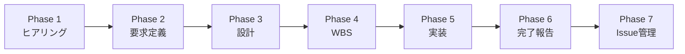

# agent-scaffold-factory

Claude Code で「自分専用のエージェント」を作るためのテンプレート集です。

## これは何？

[Zenn 連載「Claude Code エージェント実践 — 自分専用の専門家を揃える」](https://zenn.dev/akira_cloudjob) の参考資料として公開しています。

```
人間（あなた）= 指揮者
  │
  ├─ データ分析エージェント
  │    「売上を地域×月で見たい」→ 要件確認→分析→納品
  │
  ├─ ワークフローエージェント
  │    「毎週自動で更新して」→ ワークフロー化
  │
  ├─ パイプラインエージェント
  │    「重いから速くして」→ スケール処理
  │
  └─ レポーティングエージェント
       「ダッシュボードに載せて」→ ツールを作る
```

## 設計思想

### 人間が指揮者である

オーケストレーションフレームワークは使いません。
**人間がエージェント間を調整する**という前提で設計しています。

### エージェントは「優秀な部下」である

```
・上司の曖昧な意図を汲み取り、明確化する
・勝手に進めず、要所で確認を取る
・成果物は必ずドキュメントとして残す
・案件から得た知識を蓄積し、継続的に成長する
```

### コンポジションでスキルを組み合わせる

```
汎用エージェント（ベース）
    │
    ├─ + BigQuery スキル ──→ データ分析エージェント
    ├─ + n8n スキル ────────→ ワークフローエージェント
    ├─ + Dataflow スキル ───→ パイプラインエージェント
    └─ + Python出力スキル ──→ レポーティングエージェント
```

## クイックスタート

### 1. このリポジトリをフォークする

```bash
git clone https://github.com/Akira-cloudjob-public/agent-scaffold-factory.git
cd agent-scaffold-factory
```

### 2. エージェントを払い出す

Claude Code で `/new-agent` コマンドを実行します。

```
/new-agent データ分析エージェント ~/projects/data-analyst
```

### 3. 払い出されたエージェントを使う

```bash
cd ~/projects/data-analyst
claude
```

```
/start-req REQ-2026-001
```

## フォルダ構成

```
agent-scaffold-factory/
├── CLAUDE.md                    ← エージェント管理者定義
├── .claude/commands/
│   └── new-agent.md             ← 払い出しコマンド
└── src/
    ├── agent-framework/         ← 汎用エージェントテンプレート
    │   ├── CLAUDE.md            ← 汎用エージェント定義
    │   ├── .claude/commands/    ← Phase管理コマンド
    │   │   ├── start-req.md
    │   │   ├── next-phase.md
    │   │   ├── status.md
    │   │   └── approve-phase.md
    │   ├── templates/           ← ドキュメントテンプレート
    │   ├── knowledge/           ← ナレッジ構造
    │   │   ├── business/        ← 業務ルール（必須読み込み）
    │   │   ├── technical/       ← 技術知識
    │   │   ├── people/          ← 関係者情報
    │   │   └── lessons/         ← 過去の教訓
    │   ├── documents/           ← 依頼別ドキュメント
    │   ├── inputs/              ← ヒアリング記録
    │   ├── outputs/             ← 成果物
    │   └── Issue/               ← 課題管理
    └── agent-management/
        └── エージェント管理簿.md  ← 払い出し履歴
```

## 標準ワークフロー



各 Phase の完了時に人間の承認を取ることで、手戻りを最小化します。

## Zenn 連載

| Week | テーマ | 記事 |
|------|-------|------|
| 1 | 汎用エージェントの仕組み | Day 1-7 |
| 2 | データ分析エージェントを育てる | Day 8-14 |
| 3 | パイプラインを作るエージェントたち | Day 15-21 |
| 4 | 道具を作るエージェント | Day 22-28 |

連載記事: [https://zenn.dev/akira_cloudjob](https://zenn.dev/akira_cloudjob)

## ライセンス

MIT License

---

**参考用です。フォークして自由にお使いください。**

質問やフィードバックは [Zenn の記事コメント](https://zenn.dev/akira_cloudjob) でお待ちしています。
